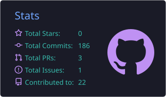
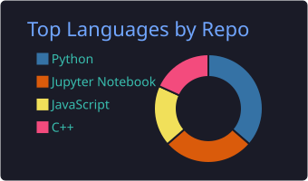
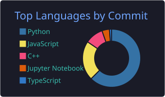
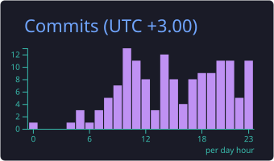

<!-- ======================= HEADER BANNER ======================= -->

<!-- Typing animation -->

 

<!-- Social / profile badges -->

 

<!-- ======================= ABOUT ======================= -->
## 👋 About Me

I'm **George Mwangi**, a Software Engineer who loves building robust web applications, exploring the systems that make them scale, and applying machine learning to real problems. I'm currently pursuing a **Bachelor's Degree in Software Engineering** at **United States International University – Africa (USIU-A)**.

- 🧠 I care about clean backends, distributed systems, and thoughtful system design.
- 🌍 I share my professional career progress, tech ideas, and honest opinions on **[LinkedIn](https://www.linkedin.com/in/georgemgichuru)** — come say hi and follow along.
- ⚡ Always experimenting at the intersection of software, data, and AI.

<!-- ======================= TECH & TOOLS ======================= -->
## 🛠️ Technologies & Tools

  
  
  
  
  
  
  
  
  
  
  
  
  
  

<b>Also worked with</b>

 

  
  
  
  

<!-- ======================= FEATURED CONTRIBUTIONS ======================= -->
## ⭐ Featured Open-Source Contributions

> Contributions I'm proud of in the broader open-source ecosystem.

- 🔥 **[Apache Spark Connect — C++ Client](https://github.com/irfanghat/spark-connect-cpp)** — contributed to bringing the Spark Connect client experience to **C++**, enabling native applications to talk to Spark clusters over the Spark Connect protocol.
<!-- Add more contributions here as you make them -->

<!-- ======================= PROJECTS ======================= -->
## 🚀 Projects

| Project | Description | Tech |
| :------ | :---------- | :--- |
| **[Snake Game](https://github.com/georgemgichuru/Snake-Game)** | A classic Snake game rendered from scratch with real-time graphics. | `C++` · `OpenGL` |
| **[Nyumbani](https://github.com/georgemgichuru/Nyumbani)** | Apartment & rental management platform for landlords and tenants — live at [nyumbanirentals.com](https://nyumbanirentals.com). | `Django` · `React` · `PostgreSQL` |
| **[Book Recommendation Engine](https://github.com/georgemgichuru/llm-semantic-book-recommender)** | LLM-powered semantic book recommender that suggests reads from natural-language queries. | `Python` · `ML` · `LLMs` |
| **_Coming soon_** | _New project — pin & describe here._ | `—` |

<!-- ======================= GITHUB STATS ======================= -->
## 📊 GitHub Contribution Stats

<!--
  These cards are generated as static SVGs by the GitHub Action in
  .github/workflows/profile-summary-cards.yml and committed into the repo,
  so they are served as plain files and never hit third-party rate limits.
-->

 

 

<!-- ======================= CERTIFICATIONS ======================= -->
## 📜 Certifications

- 🏅 **Junior Web Developer** — *Codingal*
- 🤖 **Fundamentals of Artificial Intelligence** — *IBM*

<!-- ======================= BOOKS ======================= -->
## 📚 Currently Reading / Favourite Books

- 📖 *The Monk Who Sold His Ferrari* — **Robin Sharma**
- 📖 *Designing Data-Intensive Applications* — **Martin Kleppmann**
- 📖 *System Design Interview* — **Alex Xu**

<!-- ======================= INTERESTS ======================= -->
## 🎯 Interests

`⚽ Soccer` &nbsp; `⛓️ Blockchain` &nbsp; `🖼️ NFTs` &nbsp; `💸 DeFi` &nbsp; `🌐 Distributed Systems` &nbsp; `🧠 AI & Machine Learning`

<!-- ======================= CONTACT ======================= -->
## 📫 Let's Connect

<!-- ======================= FOOTER ======================= -->

